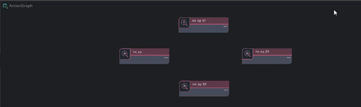

# Quality Of Life

Double clicking a graph node material node or partical graph in the stage tree will open it in its respecive graph

***Functionality By Hotkey***.

- `Number Pad 4` - Align Selected Graph Nodes Vertical To Left Most Node.
- `Number Pad 5` - Align Selected Graph Nodes Vertical To The Avarage Mid Point.
- `Number Pad 6` - Align Selected Graph Nodes Vertical To Right Most Node.
- `Number Pad 8` - Align Selected Graph Nodes Horizontal To Top Most Node.
- `CTRL + Number Pad 5` - Align Selected Graph Nodes Horizontal To Avarage Mid Point.
- `Number Pad 2` - Align Selected Graph Nodes Horizontal To Bottom Most Node.

- `Number Pad 0` - Close Selected Node details.
- `Number Pad 1` - Min Selected Node details.
- `Number Pad 3` - Open Selected Node details.
- `Number Pad Del` - Toggle Selected Node details Open Close.
